# Proyecto Blackllist-service 
## Entrega 1 - Informe

## 1. Integrantes : *Grupo 12*
- Oscar Saraza
- Keneth Bravo
- Juan Camiño Peña
- David Gutierrez

**Link Video Presentación Entrega 1:** [Video Entrega 1 DevOps Blacklist-service](https://uniandes-my.sharepoint.com/:v:/g/personal/k_bravop_uniandes_edu_co/IQDQ_fLqKD2rQbsrEP7JTGCSAVl-8dSYC5DPPPepnLZb2yU?nav=eyJyZWZlcnJhbEluZm8iOnsicmVmZXJyYWxBcHAiOiJPbmVEcml2ZUZvckJ1c2luZXNzIiwicmVmZXJyYWxBcHBQbGF0Zm9ybSI6IldlYiIsInJlZmVycmFsTW9kZSI6InZpZXciLCJyZWZlcnJhbFZpZXciOiJNeUZpbGVzTGlua0NvcHkifX0&e=8PYwba)

## 2. Descripcion de la solucion
El microservicio fue desarrollado utilizando Flask, un framework ligero de Python para la construcción de APIs REST, el cual permite gestionar las operaciones de la lista negra de correos electrónicos.

Para la persistencia de datos se utilizó PostgreSQL a través de Amazon RDS, garantizando almacenamiento confiable y gestionado en la nube.

El código fuente se administra en GitHub, facilitando el control de versiones y la trazabilidad del desarrollo.

El despliegue de la aplicación se realizó en Elastic Beanstalk, servicio PaaS de AWS que automatiza la provisión de infraestructura, incluyendo instancias EC2, balanceo de carga y escalamiento automático.

Adicionalmente, la infraestructura fue definida y aprovisionada mediante Terraform, permitiendo gestionar los recursos de AWS de forma declarativa y reproducible.

## 3. Evidencia del despliegue paso a paso
### 3.1 Configuracion de RDS

A continuación se presentan las capturas de pantalla del proceso de creación de la base de datos en RDS mediante Terraform y el resultado obtenido en la consola de AWS. Se hizo uso de la versión 15 de Postgres ejecutandose sobre una instancia EC2 t3.micro. La base de datos se encuentra en una subred privada y solo es accesible desde la VPC de Elastic Beanstalk.

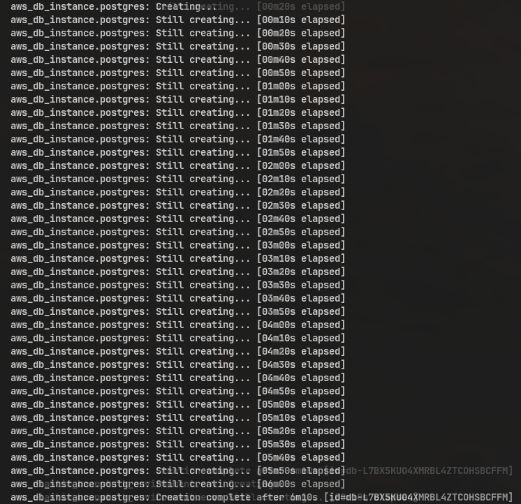
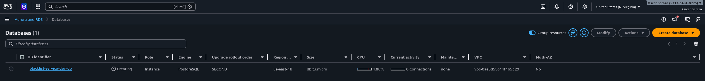 

El siguiente es el contenido del archivo de configuración de rds en el que se especifica el uso de Postgres15

```hcl
resource "aws_db_parameter_group" "postgres_params" {
  name        = "${var.app_name}-${var.environment}-pg-params"
  family      = "postgres15"
  description = "RDS parameter group for ${var.app_name}"
}

resource "aws_db_subnet_group" "default" {
  name       = "${var.app_name}-${var.environment}-sbg"
  subnet_ids = [aws_subnet.public_1.id, aws_subnet.public_2.id]

  tags = {
    Name        = "${var.app_name}-${var.environment}-subnet-group"
    Environment = var.environment
  }
}

resource "aws_db_instance" "postgres" {
  identifier             = "${var.app_name}-${var.environment}-db"
  instance_class         = var.db_instance_class
  allocated_storage      = var.db_allocated_storage
  engine                 = "postgres"
  engine_version         = "15" # Utilizing major version 15 defaults
  username               = var.db_username
  password               = var.db_password
  db_name                = var.db_name
  db_subnet_group_name   = aws_db_subnet_group.default.name
  vpc_security_group_ids = [aws_security_group.rds_sg.id]
  parameter_group_name   = aws_db_parameter_group.postgres_params.name
  publicly_accessible    = false
  skip_final_snapshot    = true # Should be false in production

  tags = {
    Name        = "${var.app_name}-${var.environment}-db"
    Environment = var.environment
  }
}
```

### 3.2 Configuracion del proyecto en AWS Elastic Beanstalk
#### Creacion de la aplicacion

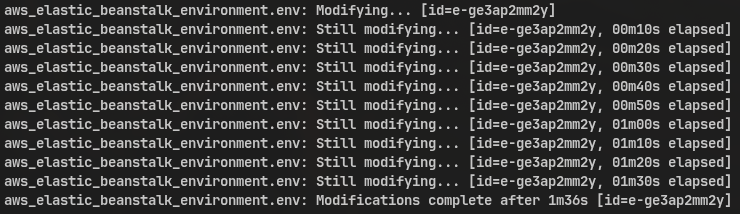

#### Roles

Para el correcto funcionamiento de la aplicación se implementaron los siguientes roles de IAM mediante Terraform:

**Service Role (`beanstalk_service_role`):** Requerido para la operación de Elastic Beanstalk que permite ver y actualizar los recursos del entorno. **Políticas:** `AWSElasticBeanstalkEnhancedHealth` y `AWSElasticBeanstalkService`.

**EC2 Instance Profile (`beanstalk_ec2_role`):** Rol para las instancias de EC2 que les permite ejecutar la aplicación e conectarse al entorno de AWS. **Políticas:** `AWSElasticBeanstalkWebTier` otorga permisos para descargar el archivo .zip con el código desde S3 y escribir logs en CloudWatch.

#### Carga del ZIP

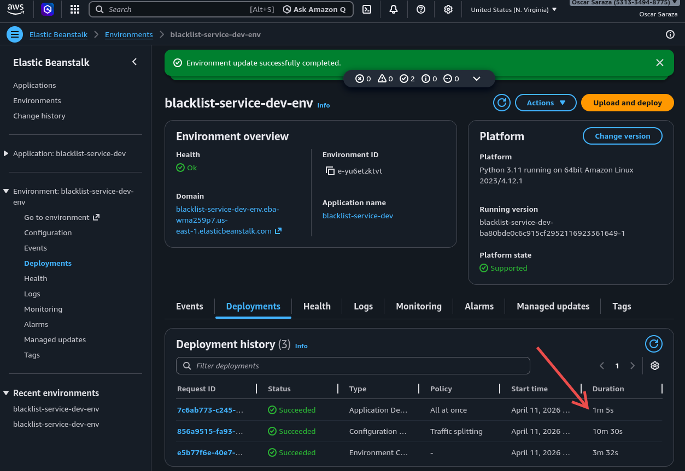

#### URL final

La URL del entorno de Elastic Beanstalk con la aplicación en operación es el siguiente: [http://blacklist-service-dev-env.eba-nm7uwni6.us-east-1.elasticbeanstalk.com](http://blacklist-service-dev-env.eba-nm7uwni6.us-east-1.elasticbeanstalk.com)

### 3.3 Configuracion de health checks

La configuración de las verificaciones de salud se realizó mediante el archivo .ebextensions/01_healthcheck.config, en el cual se especifica que debe usar el endpoint /health de la aplicación. La siguiente es una captura de /health en funcionamiento.


## 4. Pruebas en Postman

La dirección de la documentación de Postman publicada es [https://documenter.getpostman.com/view/5048503/2sBXitDT2f](https://documenter.getpostman.com/view/5048503/2sBXitDT2f)

## 5. Estrategias de despliegue

### 5.1 All at once

#### Cantidad de instancias

De acuerdo con las instrucciones, se usaron mínimo 3 instancias y máximo 6, configuradas en terraform como MinSize y MaxSize del namespace aws:autoscaling:asg.

#### Como se valido el despliegue

Se valida que el despliegue está operativo en el estado de salud del entorno en AWS Elastic Beanstalk, el cual debe estar en estado "Green" y mediante la navegación a la URL del entorno.

Luego se ejecutaron las pruebas de postman con el commando:

newman run blacklist_service.postman_collection.json --env-var "baseUrl=http://blacklist-service-dev-env.eba-wma259p7.us-east-1.elasticbeanstalk.com"

y se puso a prueba el funcionamiento de la aplicación haciendo peticiones recurrentes al endpoint /health y a la creación de nuevos registros en la lista negra usando curl con los siguientes scripts:

for i in {1..1000000}; do 
  curl -s -o /dev/null -w "Status: %{http_code} Time: %{time_total}s\n" http://blacklist-service-dev-env.eba-wma259p7.us-east-1.elasticbeanstalk.com/health & 
done; wait

for i in {1..1000000}; do 
  curl -s -o /dev/null -w "Status: %{http_code} Time: %{time_total}s\n" \
  -X POST "http://blacklist-service-dev-env.eba-wma259p7.us-east-1.elasticbeanstalk.com/blacklists" \
  -H "Authorization: Bearer devops-static-token" \
  -H "Content-Type: application/json" \
  -d '{"email": "loadtest_'$i'_'$RANDOM'@example.com", "app_uuid": "123e4567-e89b-12d3-a456-426614174000", "blocked_reason": "testing load"}' & 
done; wait

#### Tiempo total

Despliegue inicial:

Creación de base de datos RDS: 6m10s
Despliegue inicial de la aplicación a Elastic Beanstalk: 2m01s
Despliegue de una nueva versión con terraform: 01m22s
Actualización cargando el .zip directamente: 1m5s

#### Instancias iniciales o nuevas

Se realizó primero el despliegue a instancias nuevas y posteriormente se repitió el proceso sobre las instancias iniciales, tanto con terraform, como cargando el archivo .zip en la consola de AWS.

#### Hallazgos

Pese a someter la aplicación a una carga de más de 200 peticiones por segundo, la aplicación mantuvo su estado de salud en "Green" y respondió correctamente a todas las peticiones sin escalar a más de 3 instancias.

#### Capturas

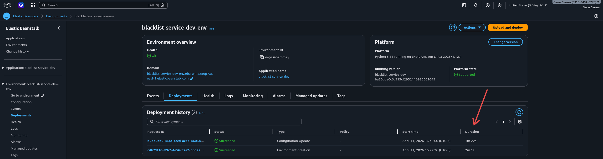
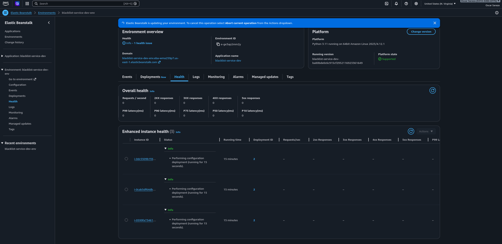
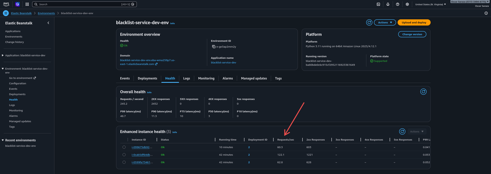
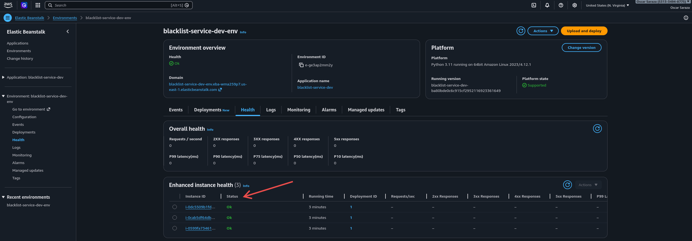
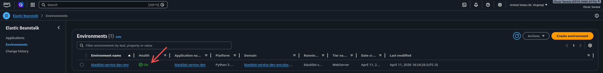

---

### 5.2 Rolling

#### Cantidad de instancias

El entorno fue configurado con un mínimo de **3 instancias EC2**, utilizando un balanceador de carga para distribuir el tráfico entre ellas.


 

#### Cómo se validó el despliegue

El despliegue fue validado mediante:

* La consola de **AWS Elastic Beanstalk**, en la pestaña *Events*, donde se observó la ejecución del proceso de actualización del entorno.


* La sección de **Implementaciones**, donde el estado del despliegue aparece como **“Succeeded”**.


* Acceso a la aplicación mediante la URL pública:

  `blacklist-service-dev-env.eba-r55pxkv7.us-east-1.elasticbeanstalk.com`

  verificando el endpoint `/health`, el cual respondió correctamente con estado `"ok"`.


* Ejecución de pruebas automatizadas en **Postman**, donde todos los endpoints respondieron correctamente sin errores.


#### Tiempo total

El tiempo total del despliegue fue aproximadamente:

* Inicio: **10:58:12**
* Fin: **10:58:57**

**Duración total: ~44 segundos**

(Este dato se obtuvo directamente de la sección *Implementaciones* en AWS Beanstalk)

#### Monitoreo


#### Instancias iniciales o nuevas

Durante la estrategia **Rolling**, el despliegue se realizó utilizando las **instancias existentes**.

* No se crearon nuevas instancias.
* Las instancias fueron actualizadas por lotes.
* Algunas instancias continuaron atendiendo tráfico mientras otras eran actualizadas.

#### Hallazgos

Durante la ejecución de la estrategia Rolling se identificaron los siguientes hallazgos:

* El despliegue se realizó de manera progresiva, actualizando las instancias en grupos (lotes).
* Se mantuvo la disponibilidad del servicio durante el proceso, ya que algunas instancias continuaban respondiendo mientras otras eran actualizadas.
* No se evidenció caída total del servicio.
* Esta estrategia representa un equilibrio adecuado entre **disponibilidad y tiempo de despliegue**.

---

### 5.3 Rolling with Additional Batch

Esta estrategia realiza el despliegue por lotes, agregando instancias adicionales temporales para mantener la capacidad durante la actualización.

#### Cantidad de instancias

El entorno fue configurado con un mínimo de 3 instancias EC2.  
Durante el despliegue se agregó 1 instancia adicional temporal (batch size = 1).


#### Cómo se validó el despliegue

El despliegue se validó mediante:

- Eventos de AWS Elastic Beanstalk (estado *Succeeded*)
- Ejecución de pruebas en Postman
- Verificación del endpoint `/health`


#### Tiempo total

El tiempo total del despliegue fue de aproximadamente:

- **44 segundos**


#### Instancias iniciales o nuevas

- Se crearon instancias adicionales temporales durante el despliegue
- Posteriormente se actualizaron las instancias existentes
- Finalmente se eliminaron las instancias adicionales

#### Hallazgos

- El despliegue se realizó sin downtime
- La aplicación se mantuvo disponible durante todo el proceso
- El uso de instancias adicionales mejora la disponibilidad
- El tiempo de despliegue es mayor que en All-at-once, pero más seguro
- Las pruebas en Postman confirmaron el correcto funcionamiento


> Esta estrategia permite mantener alta disponibilidad agregando capacidad temporal durante el despliegue.


### 5.4 Immutable o Traffic splitting
#### Cantidad de instancias

Se usaron 3 instancias EC2, con un balanceador de carga de aplicación. Fue necesario eliminar la aplicación creada nuevamente ya que el traffic splitting no funciona con un balanceador de carga clásico.

#### Como se valido el despliegue

Se validó el despliegue mediante la consola de AWS Elastic Beanstalk, donde se pudo consultar el estado del proceso de actualización.

Asimismo, se uso el navegador para verificar el endpoint /health, el cual respondió correctamente con estado "ok".

#### Tiempo total

Tal como se evidencia en las capturas de pantalla del proceso, el tiempo de despliegue fue de 10 minutos y 30 segundos. Esto en razón al tiempo que toma el despliegue y verificación de funcionamiento de la nueva versión, con lo cual se ejecutaron durante 5 minutos 6 instancias EC2 (3 de la versión anterior y 3 de la nueva) repartiendo el tráfico entre ambas versiones (15% a las instancias nuevas).

#### Instancias iniciales o nuevas

Para verificar el proceso de transición a la nueva versión se requirió la ejecución del despliegue sobre instancias previamente inicializadas.

#### Hallazgos

Aunque la estrategia Immutable permite una transición más segura a una nueva versión, se observó que el tiempo de despliegue fue significativamente mayor en comparación con otras estrategias.

#### Capturas

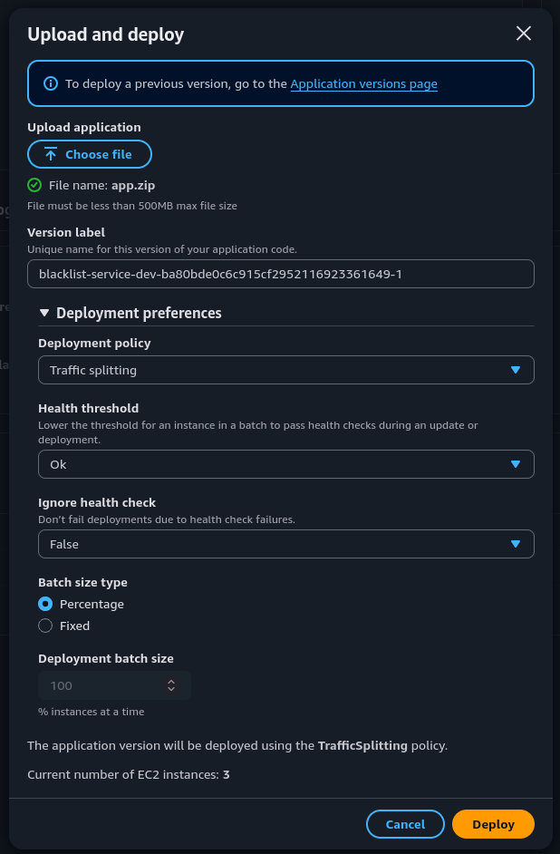
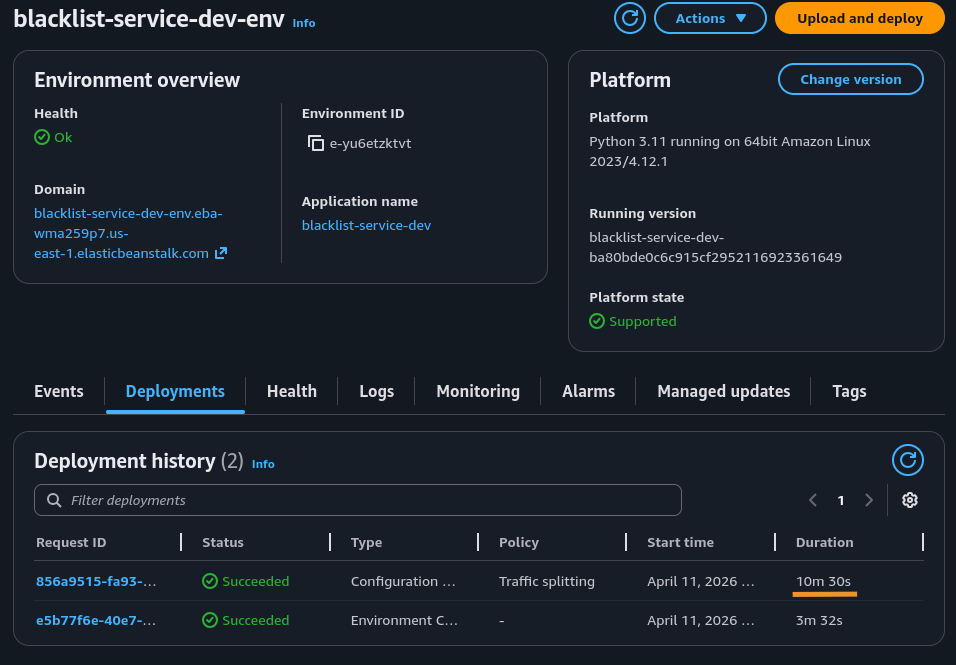
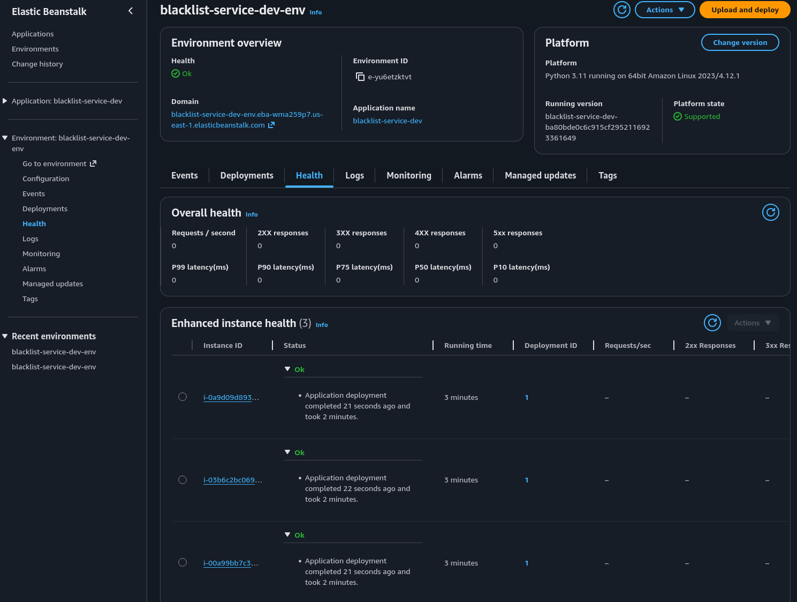
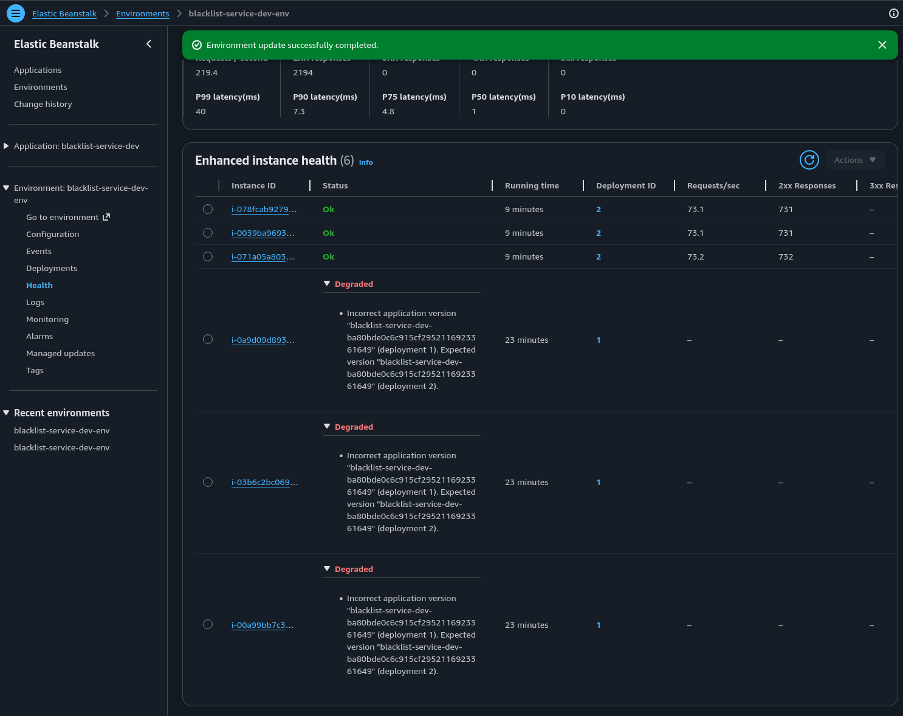
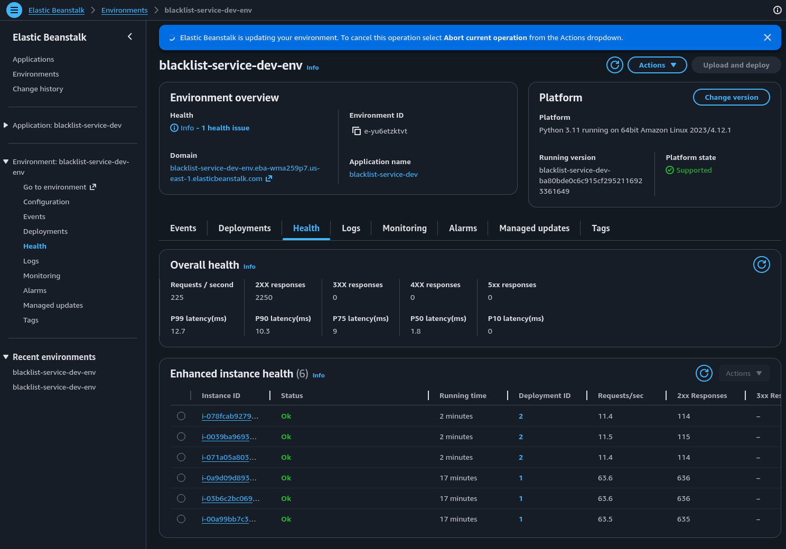
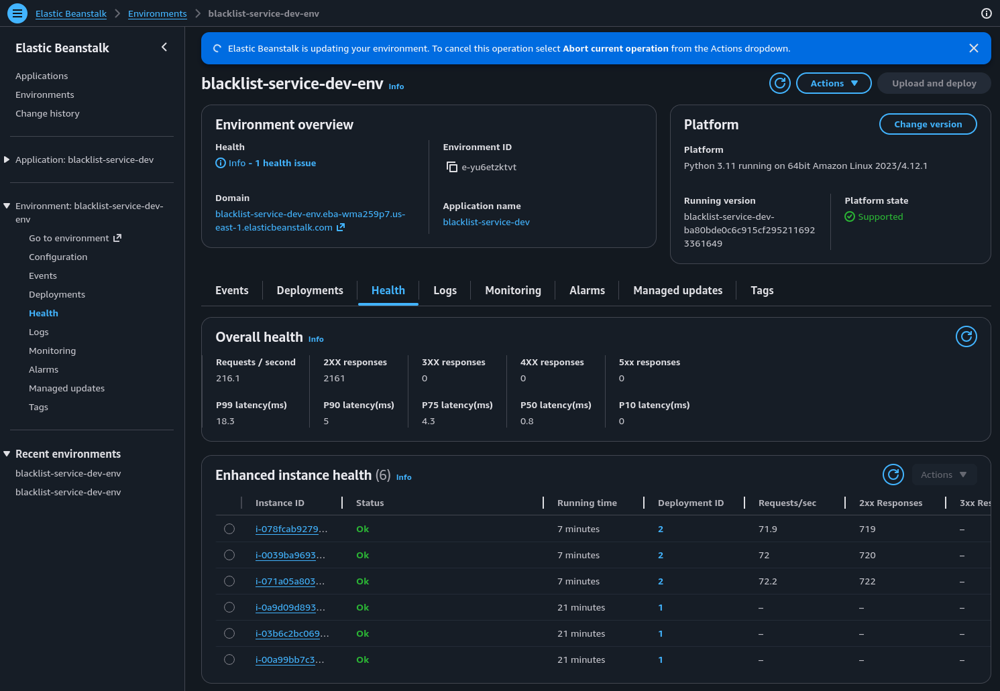
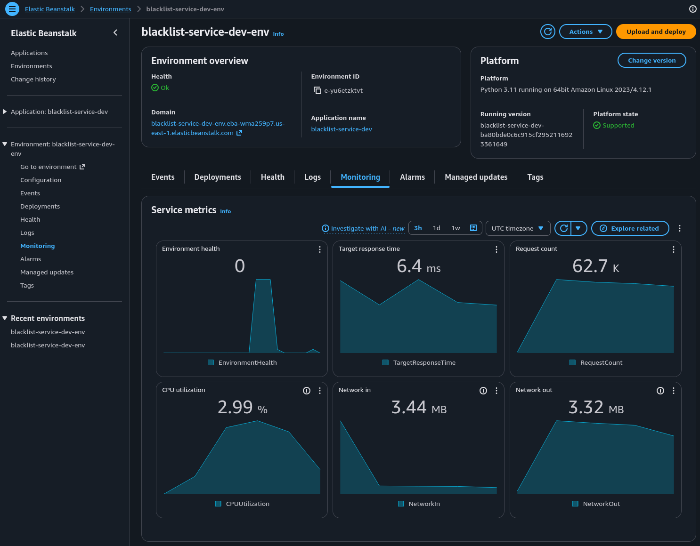

## 6. Repositorio GitHub
- URL del repositorio: https://github.com/KenethBravoP/blacklist_service
- Rama usada : *MASTER*


## 7. Conclusiones
- Que funciono bien

El despliegue de la aplicación resultó más sencillo mediante el uso de Terraform, de modo que el proceso pudo replicarse de manera consistente por todos los integrantes del equipo.

- Que dificultades hubo

El uso de algunas variables de Terraform marcadas como "sensibles" hicieron que en repetidas ocasiones se ejecutara una eliminación y recreación completa de la base de datos de RDS, lo cual extendió el tiempo de ejecución de los despliegues debido a que en RDS no puede cambiarse el nombre de usuario principal de la instancia. Finalmente se optó por asignar un nombre de usurio fijo y manejar como dato sensible únicamente la constraseña de la base de datos.

- Que aprendieron sobre despliegue manual en PaaS

La configuración inicial del entorno en la consola deAWS es un proceso que requiere tiempo y atención al detalle, ya que cualquier error u omisión causa retrasos en el proceso. La automatización mediante Terraform simplifica el proceso y reduce la probabilidad de errores.