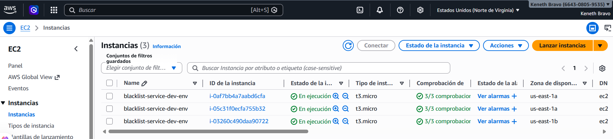
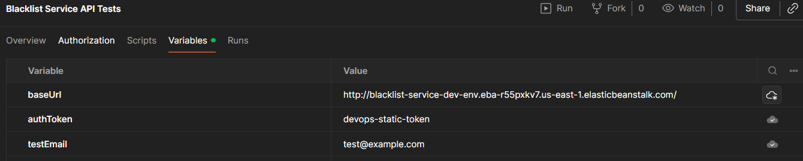

# Proyecto Blackllist-service 
## Entrega 1 - Informe

## 1. Integrantes : *Grupo 12*
- Oscar Saraza
- Keneth Bravo
- Juan Camiño Peña
- David Gutierrez

## 2. Descripcion de la solucion
El microservicio fue desarrollado utilizando Flask, un framework ligero de Python para la construcción de APIs REST, el cual permite gestionar las operaciones de la lista negra de correos electrónicos.

Para la persistencia de datos se utilizó PostgreSQL a través de Amazon RDS, garantizando almacenamiento confiable y gestionado en la nube.

El código fuente se administra en GitHub, facilitando el control de versiones y la trazabilidad del desarrollo.

El despliegue de la aplicación se realizó en Elastic Beanstalk, servicio PaaS de AWS que automatiza la provisión de infraestructura, incluyendo instancias EC2, balanceo de carga y escalamiento automático.

Adicionalmente, la infraestructura fue definida y aprovisionada mediante Terraform, permitiendo gestionar los recursos de AWS de forma declarativa y reproducible.

## 3. Evidencia del despliegue paso a paso
### 3.1 Configuracion de RDS
Inserte capturas y describa motor, seguridad, endpoint y base de datos.

### 3.2 Configuracion del proyecto en AWS Elastic Beanstalk
Inserte capturas de:
- creacion de la aplicacion
- roles
- variables de entorno
- carga del ZIP
- URL final

### 3.3 Configuracion de health checks
Inserte capturas del path `/health` y evidencia de estado verde/ok.

## 4. Pruebas en Postman
- URL del workspace o documentacion publicada
- Capturas del POST exitoso
- Capturas del GET existente
- Capturas del GET inexistente
- Capturas de errores de autenticacion o validacion

## 5. Estrategias de despliegue
### 5.1 All at once
- Cantidad de instancias
- Como se valido el despliegue
- Tiempo total
- Instancias iniciales o nuevas
- Hallazgos
- Capturas
----
### 5.2 Rolling

#### Cantidad de instancias

El entorno fue configurado con un mínimo de **3 instancias EC2**, utilizando un balanceador de carga para distribuir el tráfico entre ellas.

 

#### Cómo se validó el despliegue

El despliegue fue validado mediante:

* La consola de **AWS Elastic Beanstalk**, en la pestaña *Events*, donde se observó la ejecución del proceso de actualización del entorno.

* La sección de **Implementaciones**, donde el estado del despliegue aparece como **“Succeeded”**.

* Acceso a la aplicación mediante la URL pública:

  `blacklist-service-dev-env.eba-...`

  verificando el endpoint `/health`, el cual respondió correctamente con estado `"ok"`.
  
* Ejecución de pruebas automatizadas en **Postman**, donde todos los endpoints respondieron correctamente sin errores.

#### Tiempo total

El tiempo total del despliegue fue aproximadamente:

* Inicio: **10:58:12**
* Fin: **10:58:57**

**Duración total: ~44 segundos**

(Este dato se obtuvo directamente de la sección *Implementaciones* en AWS Beanstalk)

---
#### Monitoreo

---

#### Instancias iniciales o nuevas

Durante la estrategia **Rolling**, el despliegue se realizó utilizando las **instancias existentes**.

* No se crearon nuevas instancias.
* Las instancias fueron actualizadas por lotes.
* Algunas instancias continuaron atendiendo tráfico mientras otras eran actualizadas.

---

#### Hallazgos

Durante la ejecución de la estrategia Rolling se identificaron los siguientes hallazgos:

* El despliegue se realizó de manera progresiva, actualizando las instancias en grupos (lotes).
* Se mantuvo la disponibilidad del servicio durante el proceso, ya que algunas instancias continuaban respondiendo mientras otras eran actualizadas.
* No se evidenció caída total del servicio.
* Esta estrategia representa un equilibrio adecuado entre **disponibilidad y tiempo de despliegue**.

---

### 5.3 Rolling with additional batch
- Cantidad de instancias
- Como se valido el despliegue
- Tiempo total
- Instancias iniciales o nuevas
- Hallazgos
- Capturas

### 5.4 Immutable o Traffic splitting
- Cantidad de instancias
- Como se valido el despliegue
- Tiempo total
- Instancias iniciales o nuevas
- Hallazgos
- Capturas

## 6. Repositorio GitHub
- URL del repositorio: https://github.com/KenethBravoP/blacklist_service
- Rama usada : *MASTER*

## 7. Conclusiones
- Que funciono bien
- Que dificultades hubo
- Que aprendieron sobre despliegue manual en PaaS
