# Proyecto Blacklist-service
## Entrega 3 - Informe

## 1. Integrantes : *Grupo 12*
- Oscar Saraza
- Keneth Bravo
- Juan Camilo Peña
- David Gutierrez

**Link Video Presentación Entrega 3:** [Video Entrega 3 DevOps Blacklist-service](https://drive.google.com/file/d/1AStfy-8X05dtEMGvWNNrBvF7EhfGUSmK/view?usp=sharing)

## 2. Descripcion de la solucion

A partir del pipeline de Integración Continua construido en la Entrega 2, en esta entrega se implementó el proceso completo de **Entrega Continua (CD)** sobre **AWS Fargate** con estrategia de despliegue **Blue/Green** orquestada por **AWS CodeDeploy**. Cada commit a la rama `master` ahora dispara automáticamente un flujo de tres etapas: el código se descarga (Source), se ejecutan las pruebas unitarias y se construye y publica una imagen Docker en Amazon ECR (Build), y finalmente se realiza el despliegue de la nueva versión en producción cambiando el tráfico de manera gradual del Target Group "azul" al "verde" sin downtime (Deploy).

La aplicación pasa de ejecutarse sobre AWS Elastic Beanstalk (Entrega 1) a correr empaquetada como contenedor sobre **Amazon ECS con tipo de lanzamiento Fargate**, detrás de un **Application Load Balancer** con dos listeners (puerto 80 para tráfico productivo y puerto 8080 para el tráfico de prueba que CodeDeploy usa durante la transición Blue/Green). La instancia de **RDS Postgres** que aprovisiona Terraform se sigue usando como base de datos del microservicio; las tareas Fargate se conectan a ella vía variable de entorno `DATABASE_URL` y un security group dedicado con regla de ingreso explícita.

El repositorio fuente del pipeline se migró a **AWS CodeCommit** (`blacklist-service-dev-repo`) para cumplir lo que pide la sección "Lugar y Formato de Entrega" del rubro. CodeCommit se aprovisiona en el mismo `terraform apply` y el código se pushea a la rama `master` de ese repo. Como CodeCommit no usa los webhooks que sí usa una conexión externa (CodeStar / CodeConnections), el disparo automático del pipeline ante cada commit se logra con una **EventBridge rule** que escucha el evento `CodeCommit Repository State Change` para la rama `master` y llama `StartPipelineExecution`.

Toda la infraestructura nueva — ECR, ALB, Target Groups, ECS Cluster, Task Definition, ECS Service con deployment-controller `CODE_DEPLOY`, CodeDeploy Application, Deployment Group, IAM roles, Security Groups, repositorio CodeCommit y la EventBridge rule del trigger — está declarada en Terraform y se aprovisiona con un `terraform apply`. Esto extiende la infraestructura existente de las Entregas 1 y 2 (VPC, subnets, RDS, CodeBuild, CodePipeline) sin modificarla.

La rúbrica recomienda hacer la configuración manual del ambiente desde la consola de AWS, pero como ya teníamos toda la infraestructura de Entregas 1 y 2 en Terraform, decidimos seguir con Terraform en vez de devolvernos a hacer cosas a mano. Nos pareció que tenía más sentido — así cualquiera del equipo puede lanzar todo y volverlo a levantar con un solo comando, sin perder nada en el camino. En el video de sustentación mostramos los recursos creados.

## 3. Despliegue del microservicio en AWS Fargate

### 3.1 Containerización de la aplicación

Para llevar el microservicio a Fargate se creó un `Dockerfile` en la raíz del repositorio. La imagen base es `python:3.11-slim`; se instalan las dependencias de sistema necesarias para `psycopg2` (compilador de C y `libpq-dev`), se copia `pyproject.toml` y `poetry.lock` antes que el código fuente para aprovechar el cache de capas de Docker, y se instalan las dependencias de producción con Poetry. El servidor de aplicación es **Gunicorn** (no el servidor de desarrollo de Flask), expuesto en el puerto `5000` y configurado con 2 workers y timeout de 60 segundos.

```Dockerfile
FROM python:3.11-slim
ENV PYTHONDONTWRITEBYTECODE=1 PYTHONUNBUFFERED=1 PIP_NO_CACHE_DIR=1 \
    POETRY_VIRTUALENVS_CREATE=false POETRY_NO_INTERACTION=1
WORKDIR /app
RUN apt-get update && apt-get install -y --no-install-recommends gcc libpq-dev \
    && rm -rf /var/lib/apt/lists/* \
    && pip install --upgrade pip && pip install poetry==1.8.3
COPY pyproject.toml poetry.lock ./
RUN poetry install --only main --no-root
COPY app ./app
COPY application.py ./
EXPOSE 5000
CMD ["gunicorn", "--bind", "0.0.0.0:5000", "--workers", "2", "--timeout", "60", "application:application"]
```

### 3.2 Arquitectura sobre Fargate

| Recurso | Configuración |
|---|---|
| ECR repository | `blacklist-service-dev-app`, mutable, force_delete activo |
| ECS Cluster | `blacklist-service-dev-cluster`, sin instancias EC2 (solo Fargate) |
| Task Definition | `awsvpc`, `FARGATE`, 512 CPU / 1024 MB, expone puerto 5000 |
| ECS Service | `desired_count=1`, `deployment_controller=CODE_DEPLOY` |
| ALB | Internet-facing en subnets `public_1` y `public_2` |
| Target Group blue | IP target type, healthcheck `GET /health`, puerto 5000 |
| Target Group green | Igual al blue |
| Listener producción | Puerto 80 → forward a `tg-blue` (CodeDeploy lo reescribe en cada deploy) |
| Listener test | Puerto 8080 → forward a `tg-green` |
| Security Group ALB | Ingress 80/8080 desde Internet |
| Security Group ECS Service | Ingress 5000 desde el SG del ALB |
| Regla extra al RDS SG | Ingress 5432 desde el SG del ECS Service |

La task definition recibe tres variables de entorno: `DATABASE_URL` (apuntando al endpoint del RDS de la Entrega 1), `AUTH_TOKEN` y `JWT_SECRET_KEY`.

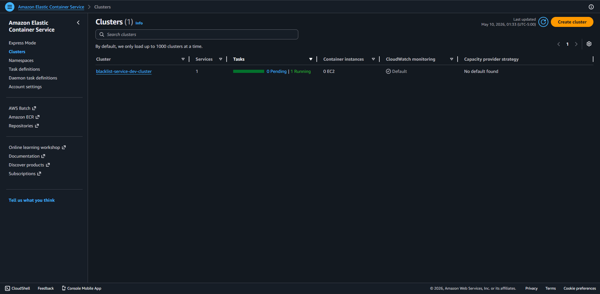

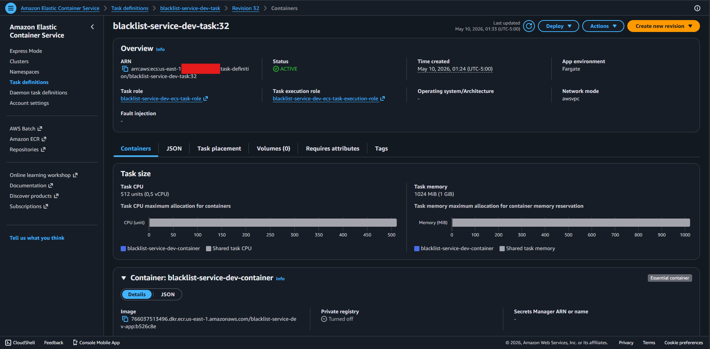

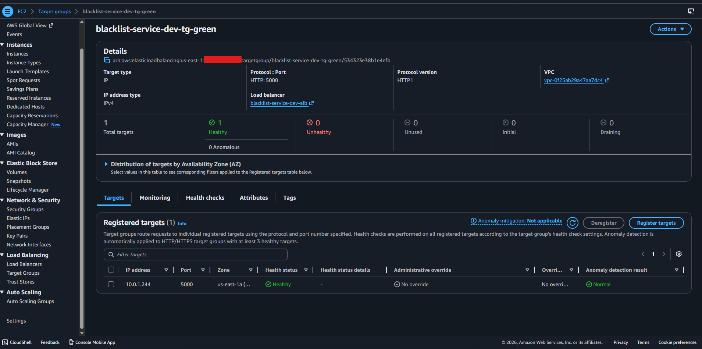

### 3.3 Validación inicial

Tras el primer `terraform apply` y el primer push de la imagen al ECR, la tarea Fargate quedó corriendo y la URL pública del ALB respondió correctamente al endpoint `/health`. La conexión al RDS se validó creando un registro nuevo vía `POST /blacklists` y consultándolo con `GET /blacklists/<email>`.

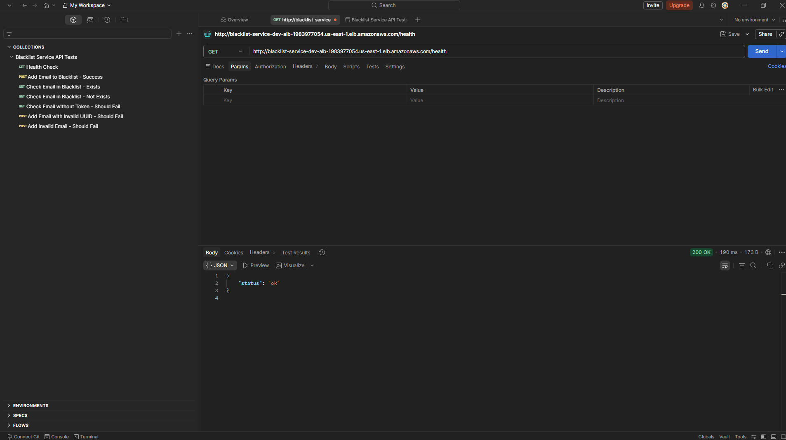

### 3.4 Pruebas unitarias sobre los endpoints

Los tests unitarios que validan la API se mantienen desde la Entrega 2 y siguen siendo el "guardián" de calidad antes de que cualquier imagen Docker llegue a Fargate: si fallan en el `pre_build` del pipeline, no hay build, no hay imagen, no hay deploy. Cada uno de los tres endpoints tiene al menos un caso de prueba asociado, cumpliendo el requisito de "al menos un escenario por cada endpoint".

| Endpoint | Método | Escenario | Test |
|---|---|---|---|
| `/health` | GET | Healthcheck responde `200 OK` con `{"status":"ok"}` | `test_health_endpoint` |
| `/blacklists` | POST | Creación exitosa devuelve `201` | `test_create_blacklist_entry` |
| `/blacklists` | POST | Email duplicado devuelve `409` | `test_create_duplicate_blacklist_entry_returns_409` |
| `/blacklists` | POST | Payload inválido devuelve `400` con detalle de errores | `test_validates_payload` |
| `/blacklists/<email>` | GET | Email registrado devuelve `is_blacklisted=true` con motivo | `test_lookup_blacklisted_email` |
| `/blacklists/<email>` | GET | Email no registrado devuelve `is_blacklisted=false` | `test_lookup_non_blacklisted_email` |
| `/blacklists/<email>` | GET | Sin token Bearer devuelve `401 Unauthorized` | `test_requires_bearer_token` |

Total: **siete escenarios** que corren en pocos segundos sobre SQLite en memoria (sin necesidad de levantar Postgres dentro del proceso de CI), tanto localmente con `poetry run pytest -v tests/` como dentro de la fase `pre_build` del pipeline que aparece en CodeBuild.

## 4. Configuración del pipeline de Entrega Continua

### 4.1 Archivo buildspec.yml

El `buildspec.yml` se reescribió por completo para soportar el flujo CD: además de correr las pruebas unitarias, ahora autentica el cliente Docker contra ECR, construye la imagen del microservicio, la etiqueta con el hash corto del commit, hace push a ECR y genera los archivos que la etapa Deploy del pipeline necesita.

```yaml
version: 0.2

phases:
  install:
    runtime-versions:
      python: 3.11
    commands:
      - python -m pip install --upgrade pip
      - pip install poetry
      - poetry config virtualenvs.create false
      - poetry install --no-interaction --no-ansi

  pre_build:
    commands:
      - poetry run pytest -v tests/
      - aws ecr get-login-password --region $AWS_DEFAULT_REGION | docker login --username AWS --password-stdin $AWS_ACCOUNT_ID.dkr.ecr.$AWS_DEFAULT_REGION.amazonaws.com
      - REPOSITORY_URI=$AWS_ACCOUNT_ID.dkr.ecr.$AWS_DEFAULT_REGION.amazonaws.com/$IMAGE_REPO_NAME
      - COMMIT_HASH=$(echo $CODEBUILD_RESOLVED_SOURCE_VERSION | cut -c 1-7)
      - IMAGE_TAG=${COMMIT_HASH:=latest}

  build:
    commands:
      - docker build -t $REPOSITORY_URI:latest .
      - docker tag $REPOSITORY_URI:latest $REPOSITORY_URI:$IMAGE_TAG

  post_build:
    commands:
      - docker push $REPOSITORY_URI:latest
      - docker push $REPOSITORY_URI:$IMAGE_TAG
      - printf '[{"name":"%s","imageUri":"%s"}]' "$CONTAINER_NAME" "$REPOSITORY_URI:$IMAGE_TAG" > imagedefinitions.json
      - printf '{"ImageURI":"%s"}' "$REPOSITORY_URI:$IMAGE_TAG" > imageDetail.json
      - sed -i "s|<EXECUTION_ROLE_ARN>|$EXECUTION_ROLE_ARN|g" taskdef.json
      - sed -i "s|<TASK_ROLE_ARN>|$TASK_ROLE_ARN|g" taskdef.json
      - sed -i "s|<DATABASE_URL>|$DATABASE_URL|g" taskdef.json

artifacts:
  files:
    - imagedefinitions.json
    - imageDetail.json
    - taskdef.json
    - appspec.yaml
  discard-paths: yes
```

Las variables de entorno (`AWS_ACCOUNT_ID`, `IMAGE_REPO_NAME`, `CONTAINER_NAME`, `EXECUTION_ROLE_ARN`, `TASK_ROLE_ARN`, `DATABASE_URL`) se inyectan al CodeBuild project desde Terraform, evitando hardcodearlas en el repositorio. El `DATABASE_URL` contiene la contraseña del RDS, que vive solo en `terraform.tfvars` (gitignored).

Para que CodeBuild pueda ejecutar `docker build`, el proyecto se configuró con `privileged_mode = true`. La policy del rol de CodeBuild se extendió con permisos `ecr:*` (BatchCheckLayerAvailability, InitiateLayerUpload, PutImage, etc.) limitados al ARN del repositorio ECR.

### 4.2 Archivos appspec.yaml y taskdef.json

`appspec.yaml` describe la implementación a CodeDeploy: indica el tipo de recurso (`AWS::ECS::Service`), el nombre del contenedor y el puerto al que el ALB debe redirigir el tráfico, y deja el placeholder `<TASK_DEFINITION>` que CodePipeline reemplaza con el ARN de la nueva revisión.

```yaml
version: 0.0
Resources:
  - TargetService:
      Type: AWS::ECS::Service
      Properties:
        TaskDefinition: <TASK_DEFINITION>
        LoadBalancerInfo:
          ContainerName: "blacklist-service-dev-container"
          ContainerPort: 5000
        PlatformVersion: LATEST
```

`taskdef.json` es la plantilla del Task Definition que se renueva en cada deploy. Contiene placeholders `<EXECUTION_ROLE_ARN>`, `<TASK_ROLE_ARN>`, `<DATABASE_URL>` (rellenados por sed en el buildspec) y `<IMAGE1_NAME>` (rellenado por la etapa Deploy del pipeline usando `imageDetail.json`).

### 4.3 Pipeline con tres etapas

La configuración del pipeline pasó de dos etapas (Source → Build) a tres (Source → Build → Deploy). La etapa nueva usa el provider `CodeDeployToECS`:

```hcl
stage {
  name = "Deploy"
  action {
    name            = "Deploy"
    category        = "Deploy"
    owner           = "AWS"
    provider        = "CodeDeployToECS"
    version         = "1"
    input_artifacts = ["build_output"]

    configuration = {
      ApplicationName                = aws_codedeploy_app.app.name
      DeploymentGroupName            = aws_codedeploy_deployment_group.app.deployment_group_name
      TaskDefinitionTemplateArtifact = "build_output"
      TaskDefinitionTemplatePath     = "taskdef.json"
      AppSpecTemplateArtifact        = "build_output"
      AppSpecTemplatePath            = "appspec.yaml"
      Image1ArtifactName             = "build_output"
      Image1ContainerName            = "IMAGE1_NAME"
    }
  }
}
```

El rol IAM del CodePipeline se extendió con permisos para invocar CodeDeploy (`CreateDeployment`, `GetDeployment`, etc.), describir y actualizar servicios ECS, registrar nuevas task definitions, y `iam:PassRole` sobre los roles de ejecución y de tarea (con la condición `iam:PassedToService=ecs-tasks.amazonaws.com`).

### 4.4 CodeDeploy Application y Deployment Group

CodeDeploy se aprovisiona en Terraform con `compute_platform = "ECS"`. El Deployment Group está configurado con:

- `deployment_type = BLUE_GREEN`, `deployment_option = WITH_TRAFFIC_CONTROL`.
- `deployment_config_name = CodeDeployDefault.ECSAllAtOnce` (cambia el 100% del tráfico al nuevo target group de una sola vez una vez validado).
- Terminación de las tareas viejas a los **5 minutos** de un deploy exitoso.
- `auto_rollback_configuration` habilitado para `DEPLOYMENT_FAILURE` y `DEPLOYMENT_STOP_ON_ALARM`.

Algo que vale la pena resaltar: además del rollback configurado por defecto, le agregamos al deployment group un `alarm_configuration` que apunta a dos CloudWatch alarms — uno por cada target group (`tg-blue-unhealthy`, `tg-green-unhealthy`) — sobre la métrica `UnHealthyHostCount`. Esto hace que CodeDeploy declare el deploy como fallido en pocos minutos cuando alguno de los target groups tiene tareas no saludables, en lugar de esperar a que se cumpla el timeout interno (que es de aproximadamente una hora). Es lo que permite que el escenario 3 (CI exitoso + CD fallido) muestre el rollback automático en un tiempo razonable y no haya que esperar 60 minutos para verlo.

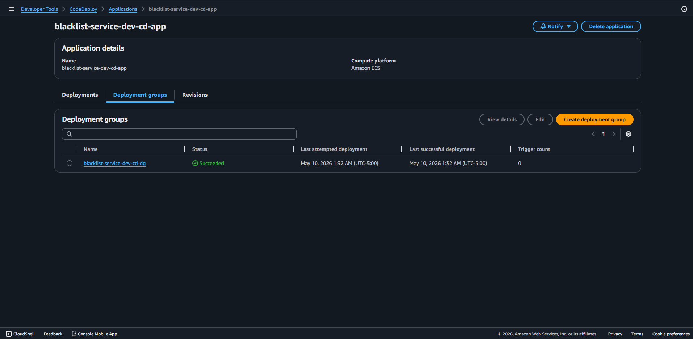

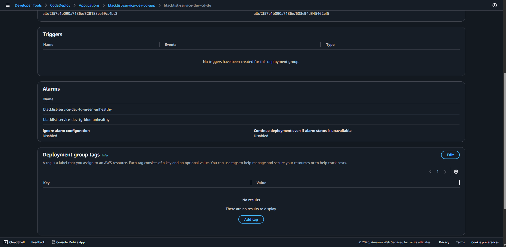

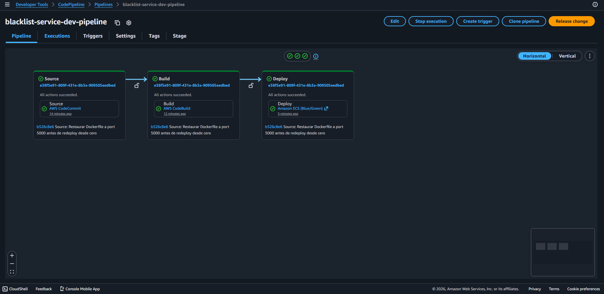

## 5. Ejecuciones del pipeline

### 5.1 Pipeline de Integración Continua fallido

#### Cambio que rompió las pruebas

Para evidenciar el comportamiento del pipeline ante un cambio inválido se agregó al final de `tests/test_blacklists.py` una prueba forzada a fallar:

```python
def test_forzar_fallo_pipeline_entrega3():
    assert False
```

Se hizo commit y push a `master`.

#### Cómo se validó la ejecución

- En **CodePipeline** la etapa `Source` quedó en verde y la etapa `Build` en rojo.
- Los logs de CodeBuild muestran la línea `FAILED tests/test_blacklists.py::test_forzar_fallo_pipeline_entrega3` y el resumen `1 failed, 7 passed`.
- La etapa `Deploy` ni siquiera se inició — el flujo se detiene al fallar el Build.
- El bucket ECR no recibió una imagen nueva, y el servicio ECS sigue corriendo la versión anterior sin verse afectado.

#### Tiempo total

- Source: 3s
- Build (install + pre_build hasta la falla en pytest): 1min y 2s
- Deploy: no ejecutado.
- **Total pipeline:** ~1min y 7s

#### Hallazgos

- Las pruebas unitarias actúan como guardián desde el principio del pipeline: si fallan, ni se construye la imagen Docker ni se contamina ECR ni se despliega nada.
- Es el comportamiento esperado de un pipeline CI/CD bien diseñado: detener tan pronto como se detecta un problema y no propagar fallas a entornos posteriores.
- El rollback no es necesario porque el deploy nunca arrancó.

#### Capturas

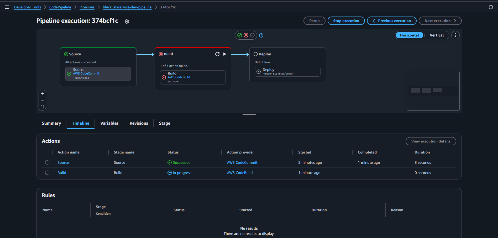
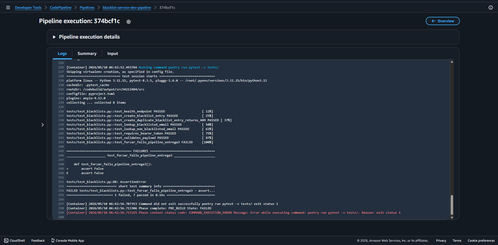
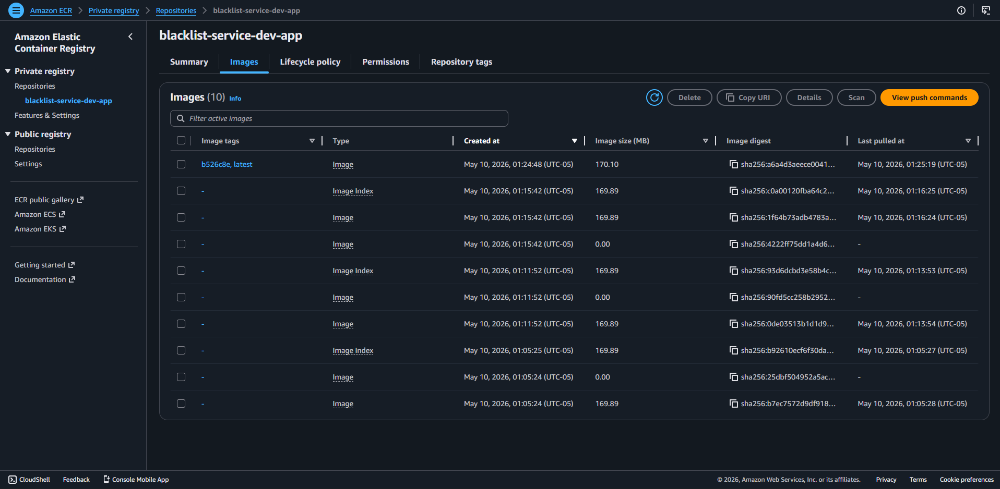

---

### 5.2 Pipeline de Integración Continua exitoso y Entrega Continua exitoso

#### Disparo del pipeline

Se hizo un cambio menor en el código (un mensaje en el endpoint raíz) y se pusheó a `master`:

```bash
git commit --allow-empty -m "Disparar pipeline CI+CD para validar escenario exitoso"
git push codecommit master
```

#### Cómo se validó la ejecución

- Las tres etapas del pipeline terminaron en **Succeeded**: Source descargó el código, Build corrió los 7 tests + construyó la imagen + la pusheó a ECR + generó los artefactos, y Deploy disparó CodeDeploy.
- En **CodeDeploy**, la consola mostró las cinco fases del Blue/Green: deploy del replacement task set, configuración de la ruta de tráfico de prueba, redirección del tráfico de producción al replacement, ventana de espera y terminación del task set original.
- Antes de la transición, el endpoint `/health` en el listener de prueba (puerto 8080) ya respondía con la nueva versión, mientras que el listener de producción (puerto 80) seguía sirviendo la versión vieja. Tras la transición, el puerto 80 sirvió la versión nueva.
- El RDS no requirió ningún cambio; las tareas nuevas tomaron la conexión a Postgres del `DATABASE_URL` heredado.

#### Tiempo total

- Source: 3s
- Build: 1min y 33s
- Deploy (incluyendo bake time + transición de tráfico): 7min y 15s
- **Total pipeline:** ~8 minutes y 54s

#### Hallazgos

- El primer deploy desde el pipeline tarda más que los siguientes porque la imagen Docker no aprovecha cache aún. Después de la primera ejecución, los rebuilds bajan de tiempo significativamente.
- La transición Blue/Green deja la aplicación accesible **todo el tiempo** desde el listener de producción: durante el deploy hay dos versiones corriendo en paralelo (una en el target group azul, otra en el verde) y CodeDeploy controla el porcentaje de tráfico.
- La nueva revisión del Task Definition aparece en ECS automáticamente; no es necesario tocar nada en consola.
- El `auto_rollback_configuration` del deployment group se quedó armado por si algo fallara — en este escenario no se activó.

#### Capturas

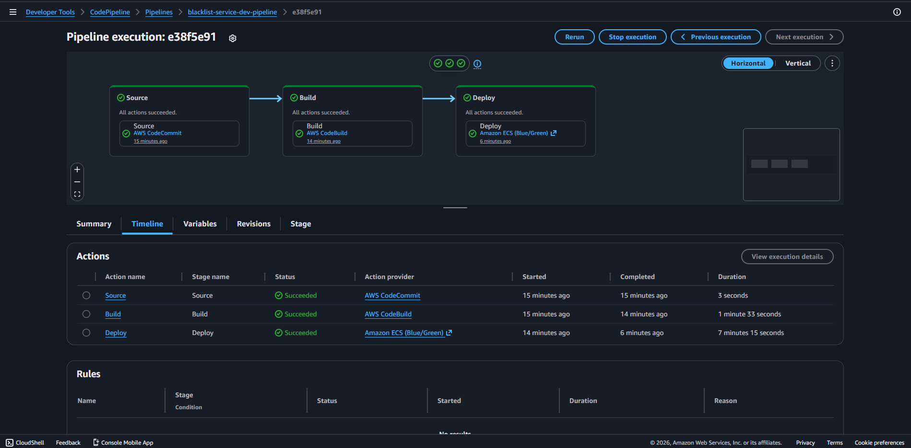
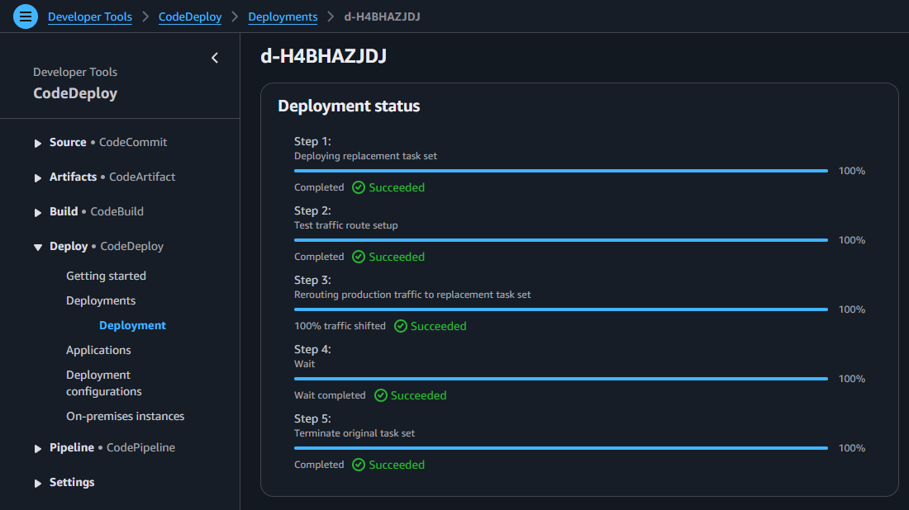
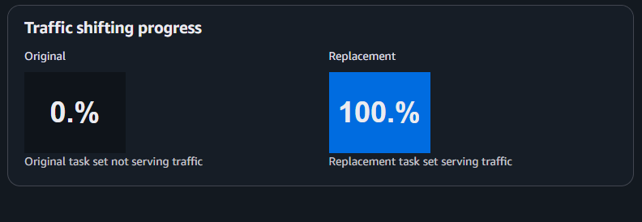
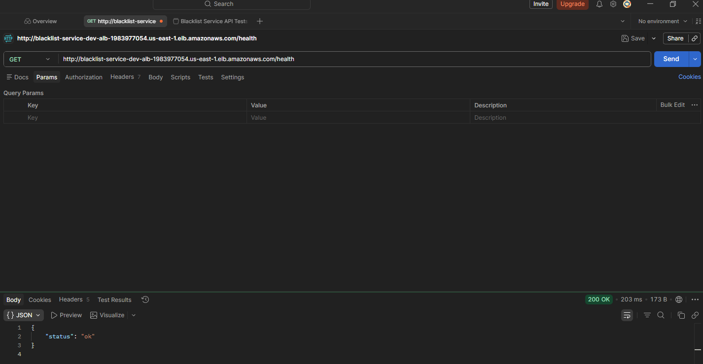


---

### 5.3 Pipeline de Integración Continua exitoso y Entrega Continua fallido

#### Cambio que rompe el deploy (no las pruebas)

Para evidenciar el caso de un CI exitoso pero CD fallido, se modificó el `Dockerfile` para que la aplicación arranque en el puerto `6000` en lugar del `5000` (cambio del `CMD`):

```dockerfile
CMD ["gunicorn", "--bind", "0.0.0.0:6000", ...]
```

Esto **no rompe las pruebas unitarias** (que corren con SQLite en memoria a nivel Python sin red), pero sí rompe el healthcheck del Target Group, que espera respuesta `200` en `:5000/health`.

#### Cómo se validó la ejecución

- Las etapas Source y Build pasaron en verde — los tests siguen corriendo bien y la imagen se construyó y se pusheó a ECR.
- En la etapa Deploy, CodeDeploy levantó las tareas nuevas en el target group verde, pero el ALB **nunca las marcó como sanas** porque el healthcheck contra `:5000/health` falla (la app está escuchando `:6000`).
- Tras varios reintentos, CodeDeploy agotó la ventana y marcó el deployment como **Failed**.
- Gracias a `auto_rollback_configuration`, CodeDeploy automáticamente terminó las tareas nuevas y dejó el tráfico apuntando al target group azul (la versión vieja, que sí responde sano). Los usuarios no vieron downtime.

#### Tiempo total

- Source: 3s
- Build: 2min y 3s
- Deploy (hasta declararse Failed + rollback): 7min y 15s
- **Total pipeline:** ~9min y 24s

#### Hallazgos

- El healthcheck del Target Group es la última línea de defensa antes de servir tráfico al usuario. Sin él, una imagen rota podría llegar a producción y romper el servicio.
- El rollback automático funcionó como se esperaba: el ALB siguió sirviendo la versión vieja en el listener de producción, y los recursos de la versión rota se limpiaron.
- En los logs de CloudWatch del task set fallido se ve claramente que gunicorn está corriendo en el puerto incorrecto, lo que valida la causa raíz.
- Después de documentar el escenario, se revirtió el cambio en el Dockerfile con `git revert HEAD --no-edit && git push codecommit master` para dejar la rama limpia.

#### Capturas

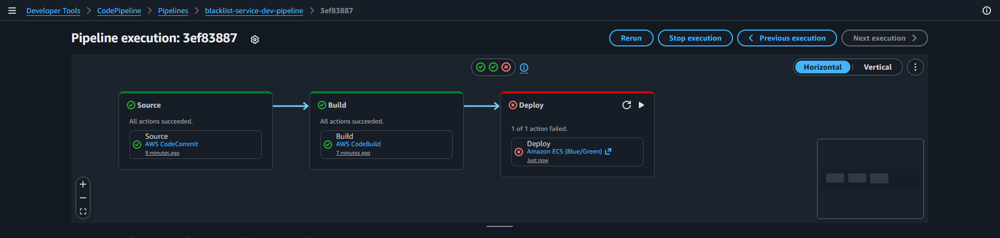
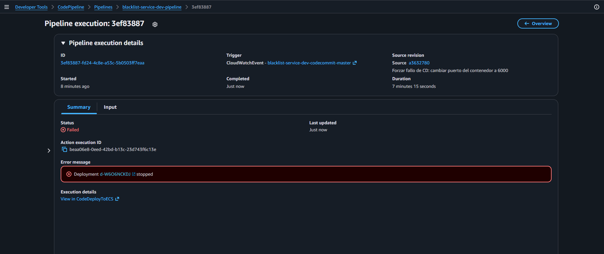
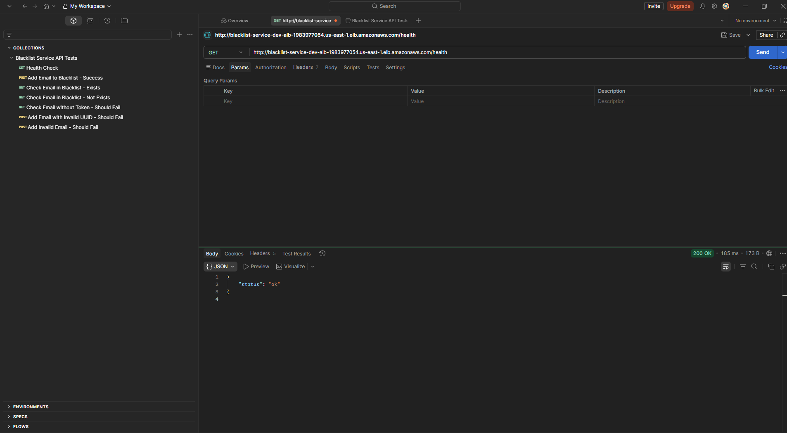

## 6. Aplicación en ejecución sobre AWS Fargate

La aplicación está accesible vía Postman en la URL pública del Application Load Balancer:

```
http://<dns-name-del-alb>
```

El DNS exacto se obtiene del output de Terraform `alb_dns_name` o desde la consola de AWS en EC2 → Load Balancers. La documentación de Postman publicada con la colección de pruebas para los endpoints es: [https://documenter.getpostman.com/view/5048503/2sBXitDT2f](https://documenter.getpostman.com/view/5048503/2sBXitDT2f).


## 7. Repositorio en AWS CodeCommit

Cumpliendo con lo que pide el rubro en la sección "Lugar y Formato de Entrega", el repositorio fuente del pipeline vive en **AWS CodeCommit**:

- Nombre del repositorio: `blacklist-service-dev-repo`.
- URL HTTPS para clonar: `https://git-codecommit.us-east-1.amazonaws.com/v1/repos/blacklist-service-dev-repo`.
- Rama escuchada por el pipeline: `master`.
- Trigger automático: **EventBridge rule** que escucha `CodeCommit Repository State Change` para `referenceUpdated` en la rama `master` y dispara `StartPipelineExecution`.

El repositorio se aprovisiona en Terraform con el recurso `aws_codecommit_repository.app`, y los desarrolladores autentican sus pushes con el `git-remote-codecommit` helper de AWS CLI (configurado a través de `git config credential.helper`). El pipeline ya no usa CodeStar Connections / CodeConnections, así que no requiere ninguna autorización manual al primer deploy.

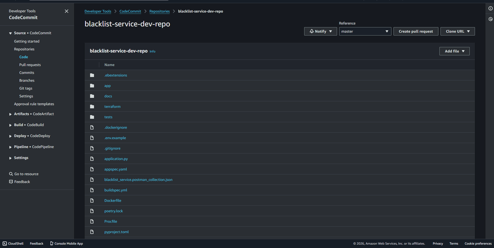

## 8. Conclusiones

La transición de un despliegue tradicional sobre Elastic Beanstalk a un despliegue Blue/Green sobre Fargate orquestado por CodeDeploy mostró que los servicios manejados de AWS están bien acoplados: el flujo Source → Build → Deploy se modela en CodePipeline con un par de etapas adicionales sobre lo ya construido en la Entrega 2, sin tener que rehacer la infraestructura desde cero.

El punto técnicamente más delicado de la entrega fue la configuración del Target Group con healthchecks contra el endpoint `/health` y la coordinación entre los dos listeners del ALB y los dos target groups que necesita Blue/Green. Una vez ese rompecabezas está armado, CodeDeploy hace el resto: registra la nueva revisión del Task Definition con la imagen recién construida, levanta el "replacement task set", valida tráfico de prueba, transfiere el tráfico productivo, espera el bake time configurado y termina las tareas viejas.

La entrega también dejó claro el valor de tener `auto_rollback_configuration` activado: el escenario de CD fallido demostró que un cambio que rompe el contenedor no llega al usuario final porque el ALB lo bloquea en el healthcheck y CodeDeploy rebobina automáticamente. En entornos productivos reales, este tipo de protección es lo que habilita despliegues frecuentes con bajo riesgo. Hacer todo esto declarativo en Terraform también significa que mañana cualquier integrante del equipo puede destruir y recrear la stack completa con un solo comando, sin pasar por la consola.
